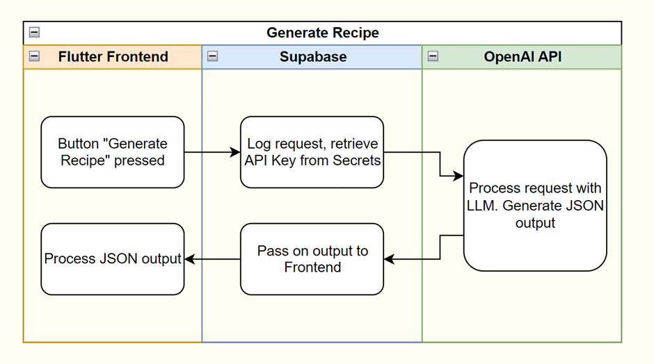

# Pantry Pal
Sören Helmreich, 06.11.2024

    

Everyone knows the problem. You’re staring into the empty fridge, wondering what you can cook with all the leftover ingredients you have.

Pantry Pal solves this problem conveniently for you. You enter all the ingredients you have available, and the App produces a list of delicious recipes you can make with minimal effort.

Before Pantry Pal existed, you had to look up recipes online, go through countless food blogs with bloated descriptions, just to end up ordering takeout again.

Traditionally, an App like this would have to access a large database or recipes. This project highlights the unique approach to this common everyday problem by using large language models to generate data. This way the recipes are highly customized to the user’s needs, whether dietary, nutritional or by limiting available ingredients.

Pantry Pal has three unique target audiences with their own needs. The following personalities undermine their differences:

**Jakob, the student**

The student likes to cook occasionally. When he comes back from class, he often finds himself hungry, but not having many fresh ingredients at home to cook with. Ordering takeout isn’t an option since he’s always low on budget. So he opens Pantry Pal on his iPhone to find quick recipes that he can make with what he has left. Since he’s currently going to the gym regularly, he wants meals with a high protein count. The app recommends a small selection of recipes, that Jakob likes. The detailed recipe makes it easy to cook a fresh and delicious meal, and with the added nutritional information, he can quickly know how much he still has to eat to meet his dietary goals. Jakob is really satisfied with the recipe, so he saves it to his account to make it another time.

**Frida, the mother**

When Frida comes home from work at midday, she only has half an hour before the kids come back from school. She wants to cook something fresh for them, but they are quite picky eaters. She has countless cooking books in the kitchen, but barely any of the recipes make everyone at the table happy. So grabs her Android phone to open Pantry Pal and types in what the fridge offers, and the different tastes of the kids. She’s quickly satisfied with one of the recommended recipes. With the detailed steps it’s easy to follow the recipe, even after coming home from exhausting work. And with the handy information on cooking time, Frida knows lunch will be on the table by the time the kids get home, and everyone will enjoy the meal together.

**Mikkel, the professional chef**

Mikkel has been a chef for many years now. He has his own restaurant focused on creating traditional Norwegian dishes, but incorporating elements from international cuisine into his creations. He likes to try out new combinations to find recipes that pleasantly surprise guests with meals they have never tried. When he’s out of creative ideas, he likes to open the Pantry Pal Web-App for some inspiration. He enters ingredients he thinks might fit together, and the app recommends fitting recipes. Mikkel is surprised by the creative combinations the app comes up with, and immediately goes to try out one of the recipes. Maybe one of them will be his next signature dish. He saves the other recommended recipes in his profile for later, maybe they’re also worth trying out.

The App is built with an agile approach. Base requirements have been gathered in the beginning, and were be expanded during development while the project grew. Milestones were:

- Initial Prototype finished
- Backend Systems finished
- User Interface finished
- Deployment finished

## Technologies

    

    

    

The project is built using [Flutter](https://flutter.dev/), an UI Framework for cross platform applications from a single codebase. Instead of developing a backend completely by myself, the project uses the Backend as a service (BaaS) Platform [Supabase](https://supabase.com/docs/guides/database/overview). The Software is available as a Web-App and an Android App. The Web-App is hosted on GitHub Pages.

The App uses a Large Language Model from OpenAI for generating the recipes. An API Key was therefore required to create the project.

The App also implements functionality to save recipes.

The user can authenticate with email and password. The authentication will be handled through [Supabase Auth](https://supabase.com/docs/guides/auth).

Once the user is logged in, they can save recipes to a [cloud Postgres database](https://supabase.com/docs/guides/database/overview), and retrieve them.

## **METRICS**

**Frontend usability**

To evaluate the business impact of Pantry Pal, we looked at how fast users can perform tasks in the app.

It’s important to get these times as low as possible as this improves user satisfaction. The app should be quick and responsive, users shouldn’t have to wait long for the recipes to be generated.

1. **Find Recipe:** How long does it take a user to enter four ingredients into the app, select a generated recipe, and save the recipe for later. The user is already logged in.
2. **Go to saved Recipe:** How long does it take a user to go to their saved recipes and open the most recently saved one. The user is already logged in.

| Task | Best Time | Average Time |
| --- | --- | --- |
| Find Recipe | 15 seconds | 54 seconds |
| Go to saved Recipe | 8 seconds | 36 seconds |

Most users were able to complete the tasks quite quickly. We therefor conclude that the frontend is very intuitive and easy to navigate.

**Recipe Quality**

Another highly important aspect is the quality and accuracy of the recipes. Large Language Models are known to suffer from hallucination (response containing false or misleading information). In this case, this could, among other things, mean unfitting ingredients, unsuitable amounts or wrong ordered recipe steps. All the three user groups described in the scope expect a recipe to be accurate and easy to follow. Wrong information will decrease the satisfaction with the app.

To evaluate this, three recipes were compared to similar recipes online, and cooked exactly the same way as instructed.

Recipes evaluated:

1. **Coconut Chickpea Curry**

Prompt: Coconut milk, chikpeas, onion, garlic, rice, curry

1. **Broccoli and Pea Stir-Fry Rice**

Prompt: Rice, broccoli, peas, peper

1. **Cheesy Aubergine Baguette Bake**

Prompt: Cheese, Aubergine, Baguette, Tomato sauce

| Recipe | Overall Quality | Cooking outcome |
| --- | --- | --- |
| **Coconut Chickpea Curry** | Very similar to recipes found online. Nutritional Information was off by a bit. Could be due to portion size being different. | Could have used a bit more seasoning. |
| **Broccoli and Pea Stir-Fry Rice** | Very similar to recipes found online. | Broccoli was slightly undercooked. Hint to cook until desired tenderness would have helped. |
| **Cheesy Aubergine Baguette Bake** | Very similar to recipes found online.  Baking temperature was lower and duration was longer. | Turned out very good. |

Most of the recipes turned out well. The user should not be a complete beginner, as some recipes require cooking techniques that are not further explained. The Nutritional Information was not perfectly accurate due do a number of possible factors.

**DATA**

To generate the data (recipes), the app uses a Large Language Model from OpenAI. By default, the [gpt-4o-mini](https://platform.openai.com/docs/models/gpt-4o-mini) is used because it’s cheap, fast and fairly accurate.

To generate a recipe, a request is first sent to a [Supabase Edge Function.](https://supabase.com/docs/guides/functions) The request is passed on from the server to the OpenAI API with the API Key for authentication.

The request body contains three values:

1. A system message to instruct the LLM what to do and how to behave.
2. A user message including the ingredients the user has available and dietary requirements.
3. A JSON object to ensure the model always generates a response following the needed data schema (see [Structured Outputs](https://platform.openai.com/docs/guides/structured-outputs/introduction))

The OpenAI API returns a JSON object containing metadata about the request, and the response message. The response is processed by the Frontend and displayed on the screen.

In order to improve speed, only recipe title, description and duration are initially generated. The remaining details (instructions, ingredients, nutritional information) is generated with a different request body on demand when the user selects a recipe.

# **MODELING**

The App uses the LLM Model [gpt-4o-mini](https://platform.openai.com/docs/models/gpt-4o-mini) from OpenAI for it’s data generation. The model supports multi-model input (accepts text / images), and has a context-window of 128k tokens. It has access to information up to the October 2023.

In comparison, the previous [GPT-3.5 Turbo](https://platform.openai.com/docs/models/gpt-3-5-turbo) had a context-window of only 16k tokens, and has knowledge of everything up to September 2021.

During development, more advanced models ([GPT-4o](https://platform.openai.com/docs/models/gpt-4o), [o1-preview and o1-mini](https://platform.openai.com/docs/models/o1)) from OpenAI were tested. While these improve the output and provide more accurate information, they are slower to respond. As discussed in Metrics, responsiveness is highly important for the success of the app. Additionally, [gpt-4o-mini](https://platform.openai.com/docs/models/gpt-4o-mini) is much cheaper than the three models above. Each generated recipe costs about $0.000375 with 4o-mini. With 4o, each generation is about 16 times more expensive.

# **DEPLOYMENT**

The Application is built for Web and Android.

The Web App is automatically deployed to GitHub Pages using GitHub Actions. This process is automatically triggered when a new push comes into the main branch of the project repository. The Web App is publicly accessible through this link: <https://soerenhelmreich.github.io/PantryPal/>

The Android Application are available in the [GitHub Releases section](https://github.com/SoerenHelmreich/PantryPal/releases). This process is also triggered through a similar GitHub Action, creating an apk file that can be installed on any Android device.

# **USE OF ARTIFICIAL INTELLIGENCE**

During programming, the AI Coding Assistant GitHub Copilot was used in Visual Studio Code to improve code quality and increase productivity.

The Icon of Pantry Pal was generated using the Bing Image Creator inside [Microsoft Copilot](https://copilot.microsoft.com/).

# **REFERENCES**

GitHub, Inc. (n.d.). _GitHub Copilot_. Retrieved from <https://github.com/features/copilot>

Google. (n.d.). _Flutter documentation_. Retrieved from <https://docs.flutter.dev/>

OpenAI. (n.d.). _OpenAI developer platform_. Retrieved from <https://platform.openai.com/docs/overview>

Supabase Inc. (n.d.). _Auth Overview_. Retrieved from <https://supabase.com/docs/guides/auth>

Supabase Inc. (n.d.). _Database Overview_. Retrieved from <https://supabase.com/docs/guides/database/overview>

Supabase Inc. (n.d.). _Edge Functions Overview_. Retrieved from <https://supabase.com/docs/guides/functions>

Supabase Inc. (n.d.). _Flutter Client Library_. Retrieved from <https://supabase.com/docs/reference/dart/start>